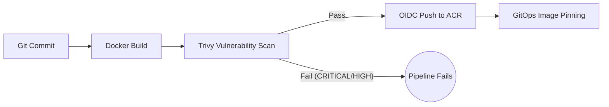

# Productionized Legacy Application (DevSecOps)

[](https://nodejs.org/)
[](https://docker.com/)
[](https://aquasecurity.github.io/trivy/)
[](https://github.com/features/actions)

A portfolio project demonstrating practical **Brownfield DevSecOps** and **Release Engineering**. 

The premise: I inherited a "legacy" Node.js inventory application. Instead of rewriting the business logic (which works), my task was to "productionize" how it builds, runs, and deploys—transforming it from a fragile script into a secure, observable, and immutable release artifact.

## 🚀 Engineering Highlights

- **Containerization Hygiene:** Introduced a multi-stage Docker build resulting in a minimal, secure image running as a **non-root user**. Added explicit `HEALTHCHECK`, structured JSON logging, and graceful shutdown (draining connections on `SIGTERM`).
- **DevSecOps Blocking Gate:** Converted Trivy from a mere advisory tool into a strict **blocking CI gate**. The pipeline halts on Critical/High CVEs in the filesystem, IaC, and container image, enforcing a baseline security policy before merging.
- **Release Contract:** Implemented a robust GitHub Actions pipeline leveraging **Azure OIDC** for secretless authentication. Images are built immutably as `legacy-app:<git-sha>`, pushed to Azure Container Registry (ACR) with digest verification, and automatically pinned via GitOps.
- **Smart CI Executions:** Added runtime change detection to ensure that documentation-only commits (like updating this README) do not trigger expensive application image builds.

## 🛠️ The Pipeline



## 📂 Project Structure

```text
src/
├── server.js              # Entry point: listen + graceful shutdown
├── app.js                 # Composition root (wiring, no logic)
├── routes/                # HTTP layer (health checks, mapping)
├── services/              # Legacy Business logic
├── middleware/            # Error handling, JSON logging
└── test/                  # Node.js smoke tests
Dockerfile                 # Multi-stage, non-root, minimal surface
.github/workflows/         # CI/CD and Trivy DevSecOps pipelines
```
